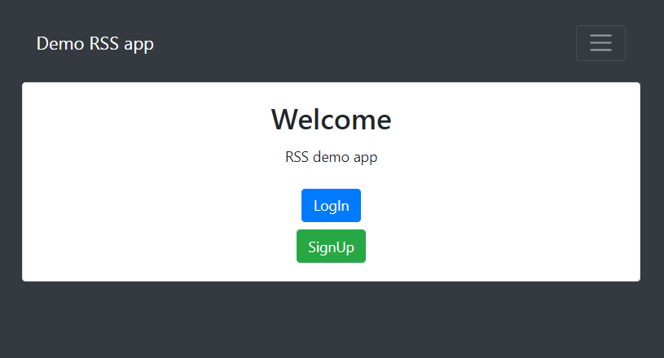
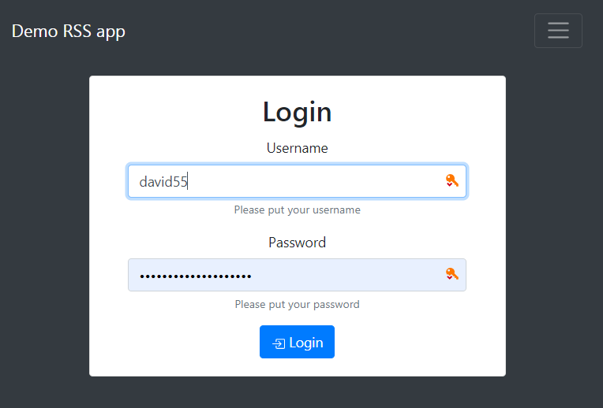
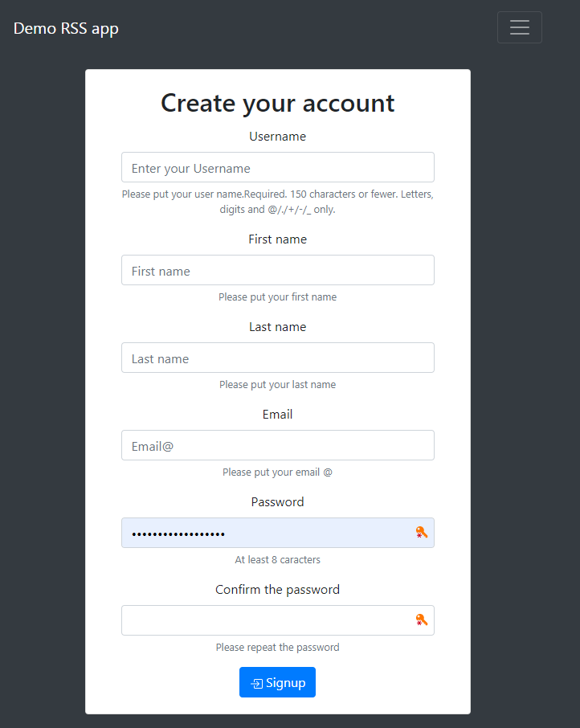
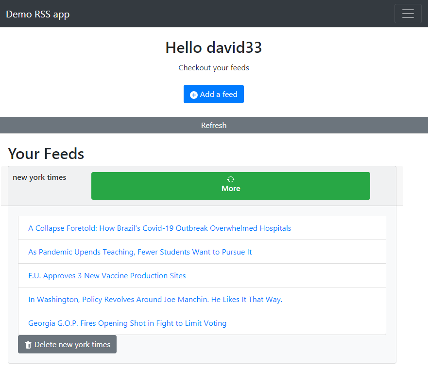
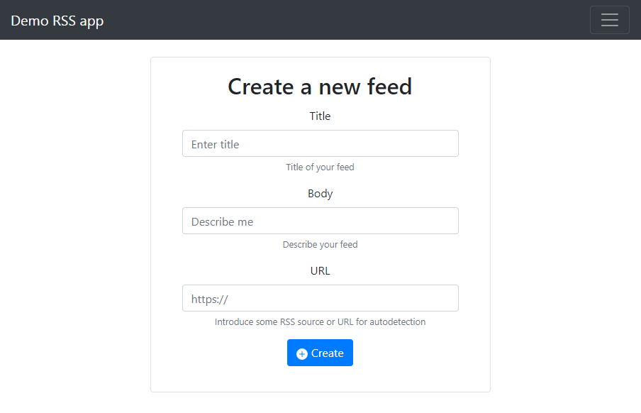

# Rss APP by Django

## **Installation:**

1.  Clone this repo

```shell
        $git clone https://github.com/DavidCastilloAlvarado/django_rssapp.git
        $cd django_rssapp
```

2.  Install and active the environment (power shell)

```shell
        $python -m pip install --user virtualenv
        $python -m venv .
        $source ./Scripts/activate
```

3.  Download all required libraries

```shell
        $pip install -r requirements.txt
```

## **Quickstart**

1. Set your own database credential Postgresql or just keep using SQLite

In `djangoblog/settings.py`:

```python

   'default': {
        'ENGINE': 'django.db.backends.postgresql_psycopg2',
        'NAME': 'MYDATABASE',
        'USER': 'postgres',
        'PASSWORD': 'admin1234',
        'HOST': '127.0.0.1',
        'DATABASE_PORT': '5432',
    }
```

2.  Make all migrations before to run

```shell
        $cd djangoblog
        $python manage.py makemigrations
        $python manage.py migrate
```

## **Using**

### Test all, models, serializers, functions

```shell

        $python manage.py test

```

### Run the server and enjoy

```shell

        $python manage.py runserver

```

## **Resume**

This works using the sqlite database

```shell
git clone https://github.com/DavidCastilloAlvarado/django_rssapp.git
cd django_rssapp
python -m pip install --user virtualenv
python -m venv .
source ./Scripts/activate
pip install -r requirements.txt
cd djangoblog
python manage.py makemigrations
python manage.py migrate
python manage.py test
python manage.py runserver
```

## **Features**

1. User login and signup.
2. Authentication to see and delete your own feeds.
3. Initially the webpage shows the first 5 entries by feed.
4. Rss source autodetection when add a new feed, if the server can’t find any then the server response with error and inform to users.
5. More entries avaliable using the bottom "More" with async method.
6. Error detection: if the RSS source fail, the error will be store into the table "log_errors".
7. The feeds have asynchronous update.
8. API implementations for manage rss feeds and user login/signup.

## **Templates**

### 1. Home page

<center>

</center>

### 1.1. Login page

<center>

</center>

### 1.2. Signup page

<center>

</center>

### 2. Home User page

<center>

</center>

### 3. Add a new feed

<center>

</center>
